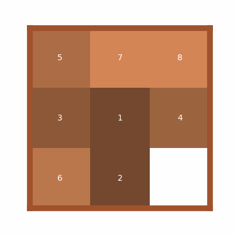
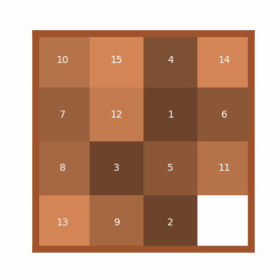
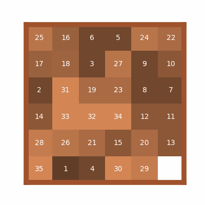

I got this results by running multiple times and taking the best ones.

Implementation detail are given in the notebook.

| Puzzle | Quality | Cost | GIF |
| ------ | ------- | ---- | --- |
|  3x3   |   26    |  1085  |  |
|  4x4   |   58    | 24497 | |
|  5x5   |   154   | 152508 | |
|  6x6   |   354   | 2216890 | |